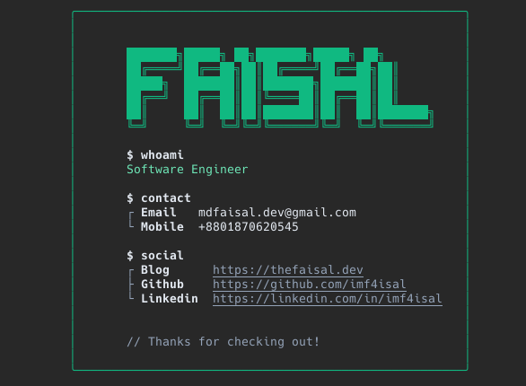

# whothefuckis

A CLI tool that displays users' information in terminal. The tool fetches data from a user's GitHub Gist and presents it in an organized, visually appealing way.

## Setup

1. Go to https://gist.github.com/
2. Create a new gist
3. Name the file as `wtfis.json`
4. Add your information in JSON format

## Installation

```bash
npx whotfis <gist-username> (e.g. npx whotfis imf4isal)
```

If you don't have a gist username, you can use your GitHub username. By default, the tool will use your GitHub username to fetch the data from your gist.

## How to Set Up Your Card

1. Create a new Gist on GitHub (https://gist.github.com)
2. Name the file `wtfis.json`
3. Add your information in JSON format

### Required JSON Structure

```JSON
{
    "name": "FAISAL",
    "designation": "Software Engineer",
    "contact": {
        "email": "mdfaisal.dev@gmail.com",
        "mobile": "+8801870620545"
    },
    "social": {
        "blog": "https://thefaisal.dev",
        "github": "https://github.com/imf4isal",
        "linkedin": "https://linkedin.com/in/imf4isal"
    }
}
```

The only required fields are `name` and `designation`.

### Customization Options

-   You can add any number of custom sections
-   Section names are flexible (e.g., "contact", "social", "skills", "interests", etc.)

```JSON
{
    "name": "FAISAL",
    "designation": "Software Engineer",
    "contact": {
        "email": "mdfaisal.dev@gmail.com",
        "mobile": "+8801870620545"
    },
    "social": {
        "blog": "https://thefaisal.dev",
        "github": "https://github.com/imf4isal",
        "linkedin": "https://linkedin.com/in/imf4isal"
    },
    "skills": {
        "languages": "JavaScript, Python, Go",
        "frameworks": "React, Node.js, Express"
    },
    "interests": {
        "hobbies": "Reading, Gaming",
        "sports": "Cricket, Football"
    }
}
```

-   Each section can have multiple key-value pairs
-   URLs will be automatically styled with underlines
-   All values within sections will be properly aligned

## Features

-   🎨 Beautiful ASCII art of your name
-   📱 Responsive terminal layout
-   🔗 Automatic URL detection and styling
-   📊 Dynamic section generation
-   🎯 Perfect alignment of values
-   🎭 Custom sections support

## Output Example


